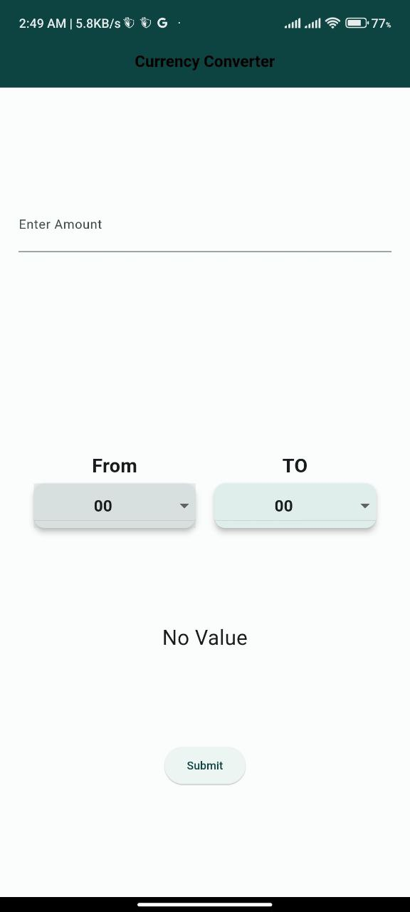
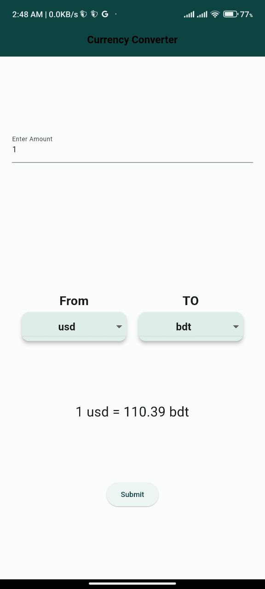

    

    <b style="font-size: 60px;">CurrecnyConverter</b>
     
    An app for calculating exchange rate

    
    
    <!--  -->

I developed a dynamic Currency Converter app that provides real-time currency exchange rates for a vast selection of global currencies. The app features a fresh and engaging user interface, ensuring an excellent user experience. It's designed as a simple and straightforward single-page application, offering ease of use and precision in currency calculations. This app caters to travelers, business professionals, and anyone seeking accurate and up-to-the-minute currency exchange information, enhancing user convenience and accessibility.

[Download CurrencyConverter](currecnyconverter.apk)
